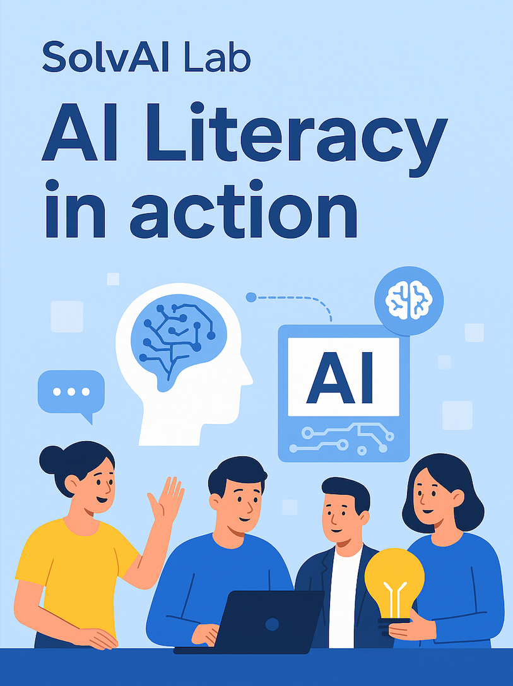
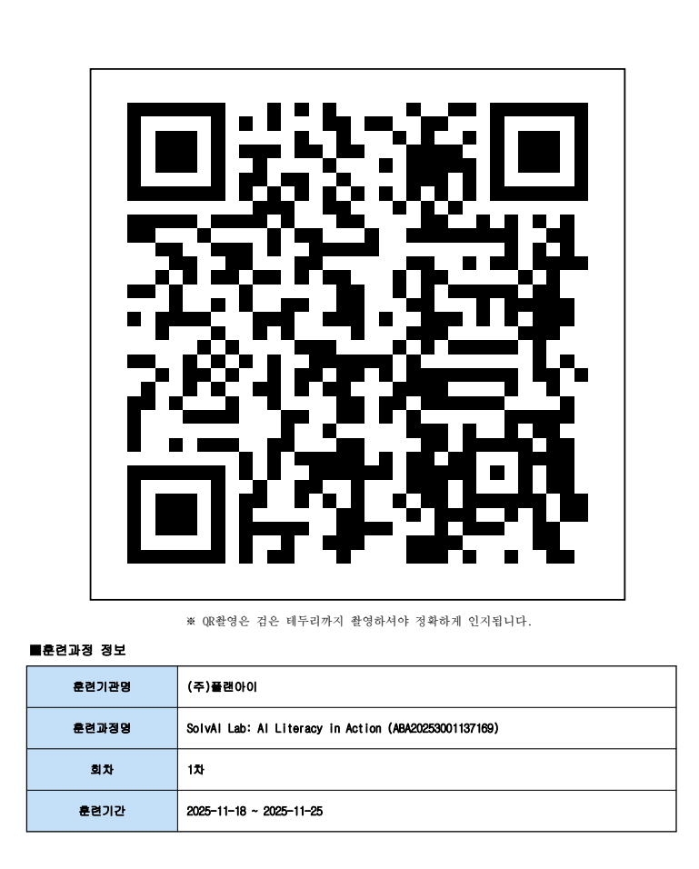

# SolvAI Lab: AI Literacy in action

## 훈련과정 상세정보

### 훈련목표
AI의 이해, AI 한계 극복, AI 서비스 발굴, AI 서비스 실험 및 평가, AI 서비스 구현을 학습한다

### 기대효과 
AI 변화에 대응하는 역량을 확보하고, 실제 직무에서 AI를 기반으로 문제 해결과 서비스 혁신을 수행

### 훈련대상요건
서비스 기획, 개발관련 직무 수행자

### 훈련 내용 (총 22시간)
| 번호 | 교과목                               | 세부내용                                                                     | 과정 시간 | 누적 시간 |
|----|-----------------------------------|--------------------------------------------------------------------------|-------|-------|
| 1  | AI의 이해                            | LLM Overview   Ollama 도구 소개   Ollama설치 및 사용방법   LLM 한계 체험 실습    | 4     | 4     |  
| 2  | AI 한계 보완                          | Ollama 모델 선정 기초   모델 성능 비교 실습   LLM 한계 보완 방법 소개    LLM 한계 보완 실습 | 4     | 8 |
| 3  | AI 서비스 발굴                         | 서비스 발굴 실습   발굴 내용 공유 및 상호 피드백   서비스 선정 및 구현 시나리오 작성                | 4     | 12 |
| 4  | AI 서비스 평가                         | 구체화 및 결과 확인 실험                                                           | 4     | 16 |
| 5  | AI 서비스 구현 | 최종 아이템 선정   프로토타입 구현                                                  | 4     | 20 |
| 6  | 과정평가                              | 2                                                                        | 2     | 22 |

# 출석 CHECK !! 
