# LLM은 무엇인가?

[//]: # (![001-001.png]&#40;../images/001-001.png&#41;)
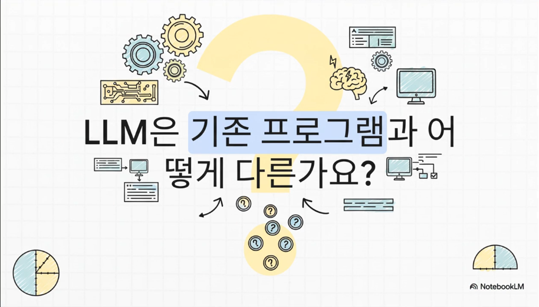
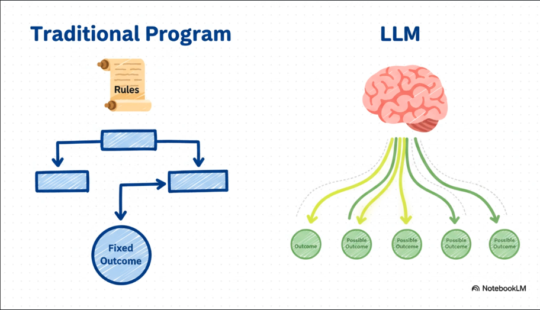

[//]: # (![001-004.png]&#40;../images/001-004.png&#41;)

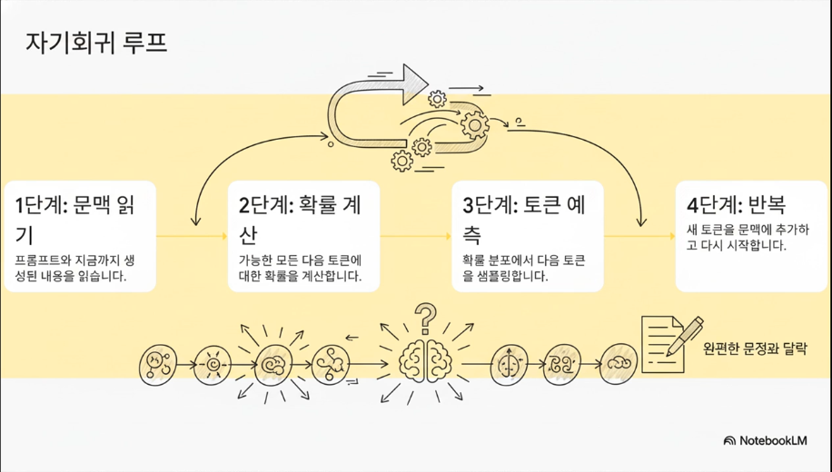
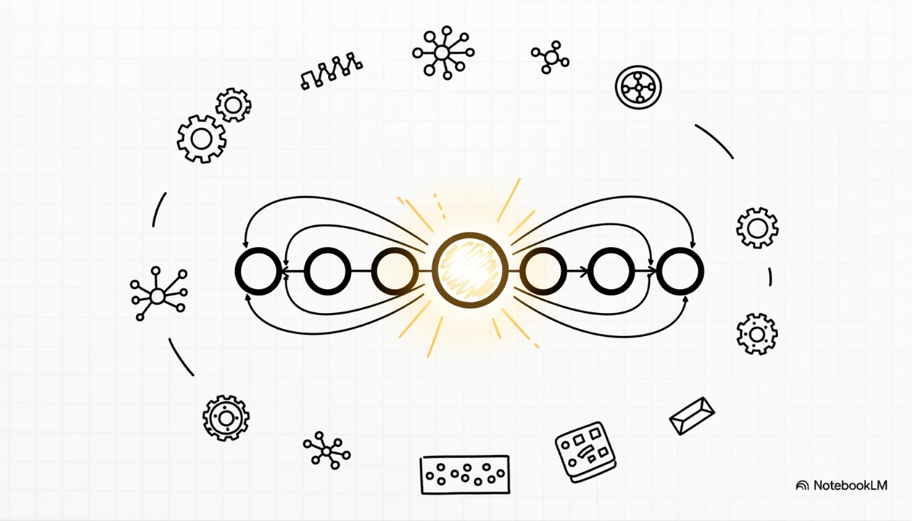

[//]: # (![001-008.png]&#40;../images/001-008.png&#41;)
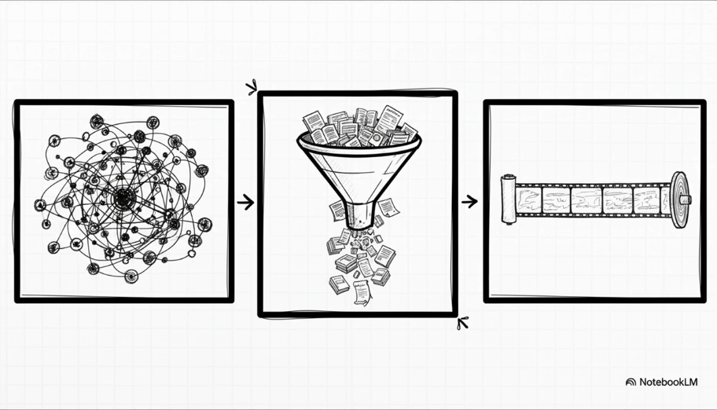

[//]: # (![001-010.png]&#40;../images/001-010.png&#41;)

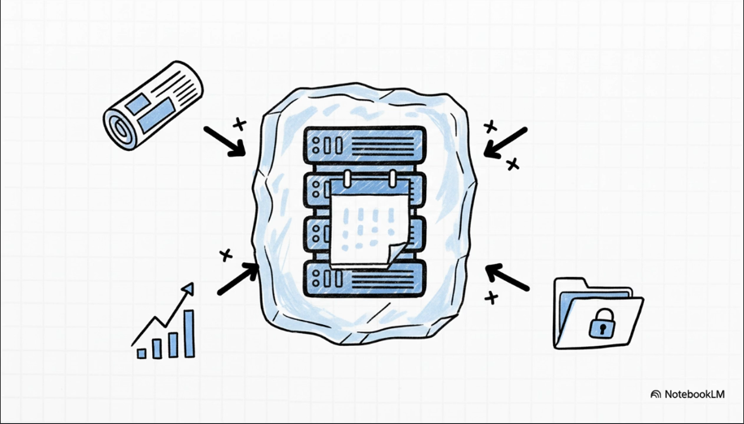
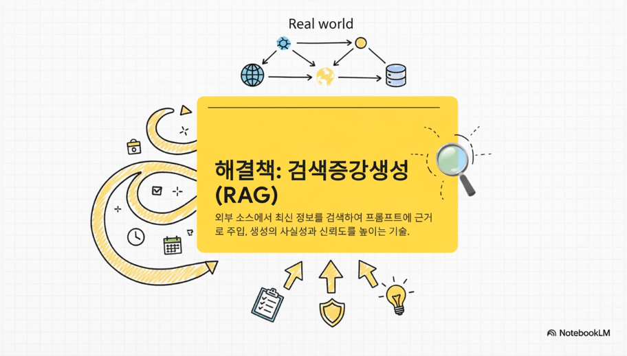
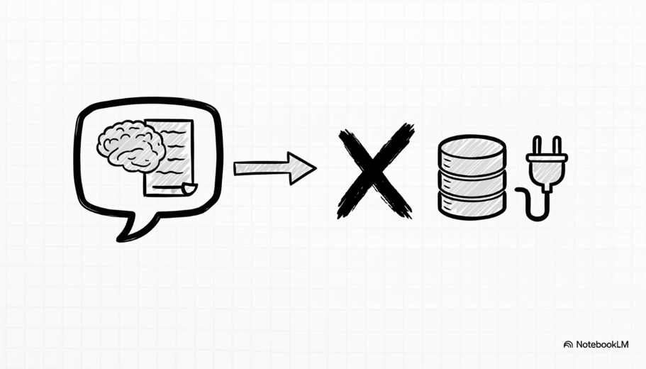
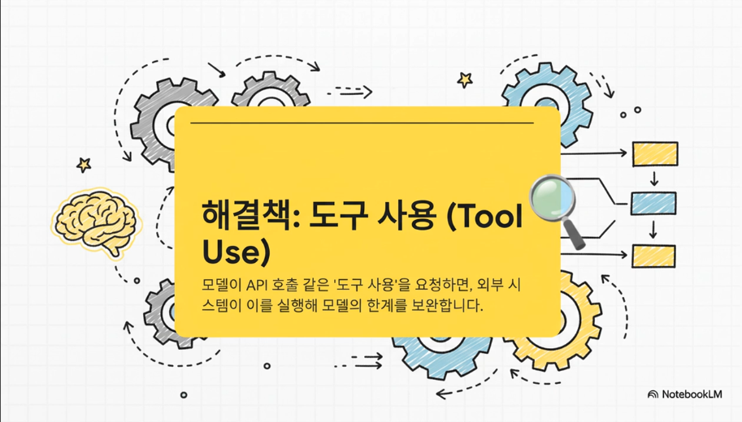

[//]: # (![001-017.png]&#40;../images/001-017.png&#41;)
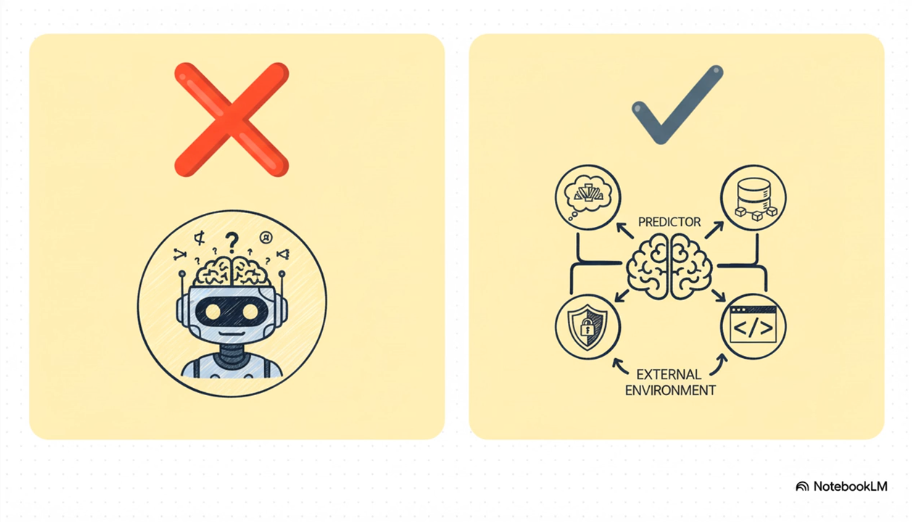
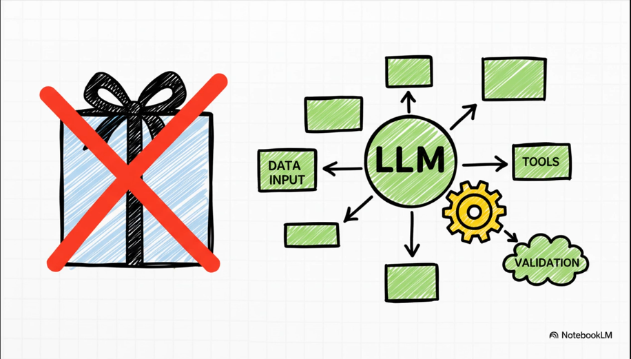
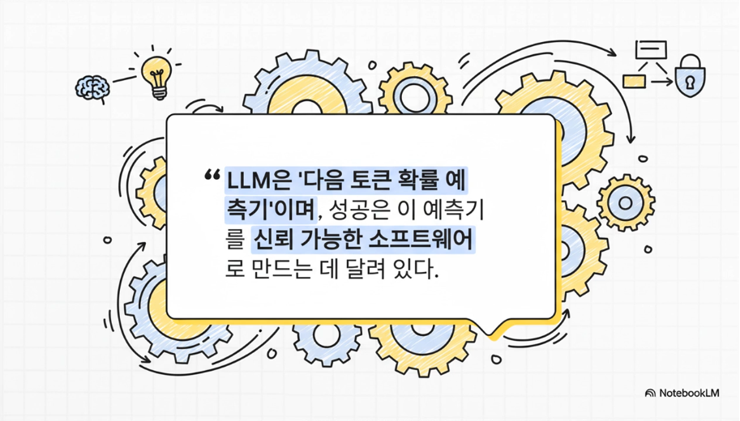
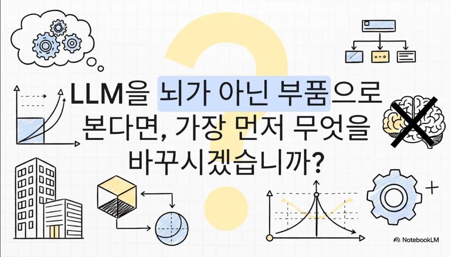