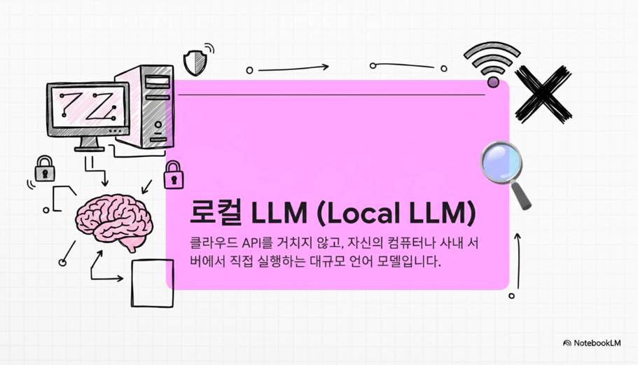
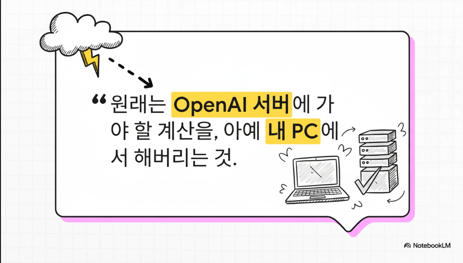
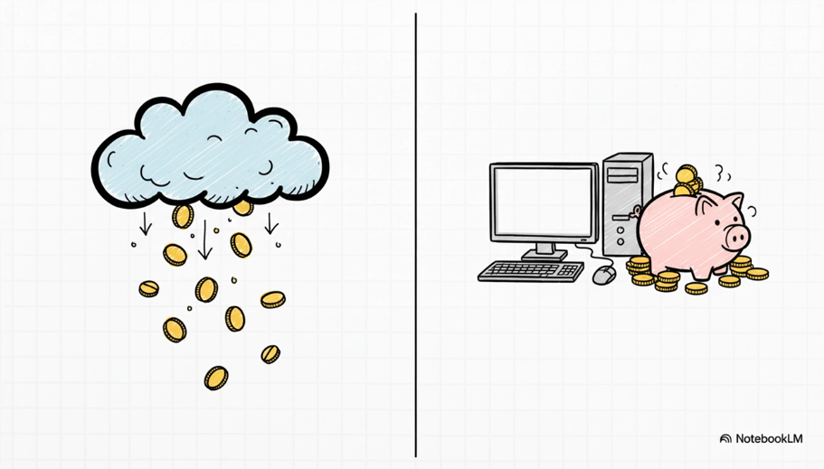
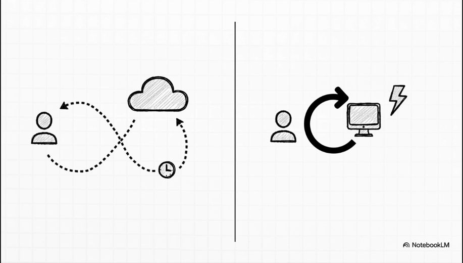
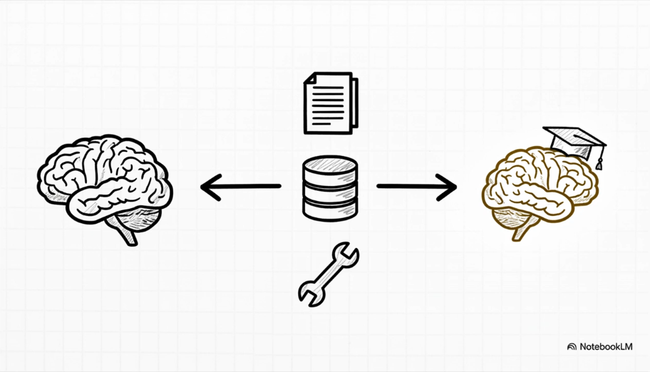
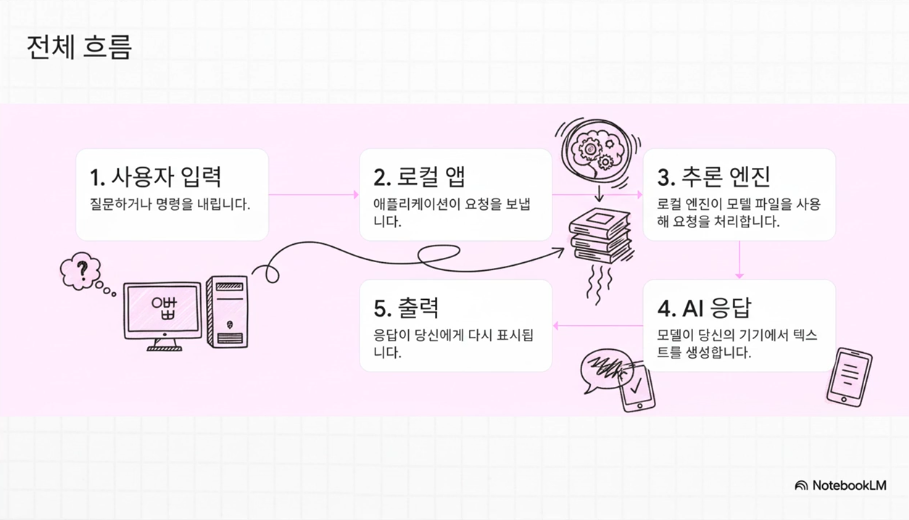
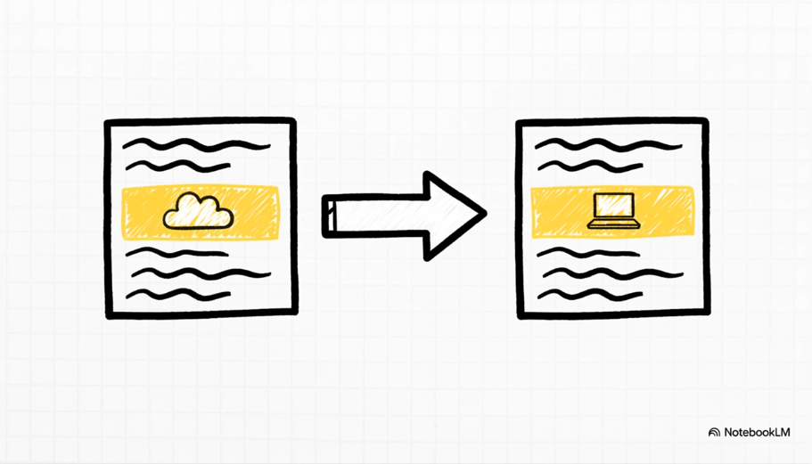
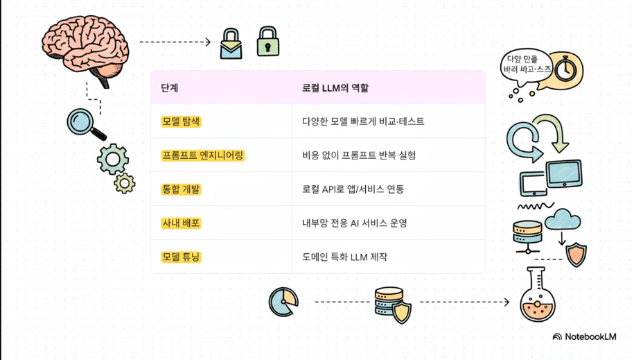

# Local LLM - 내 PC / 사내망에서 돌아가는 언어 모델

[//]: # (![004-001.png]&#40;../images/004-001.png&#41;)

# 자주 쓰이는 도구들
실무에서 Local LLM을 쓸 때 자주 등장하는 도구들은 다음과 같습니다.

* **Ollama**
    * 로컬에서 LLaMA, Mistral, Phi, Gemma 등 다양한 모델 실행 지원
    * 간단한 CLI + OpenAI 호환 REST API 제공 → 기존 코드와 연동이 편함
* **LM Studio**
    * GUI(그래픽 화면) 기반으로 모델 다운로드, 실행, 채팅 테스트까지 지원
    * “코딩 없이 감 잡기”에 좋음
* **GPT4All**
    * 윈도우/맥/리눅스에서 다양한 모델을 로컬 실행
    * 초보자/개인 사용자에게 친숙한 도구
* **vLLM / Text Generation WebUI / KoboldCpp 등**
    * **고성능 서버(GPU 여러 장)**를 활용하는 환경에서 많이 사용
    * 속도·동시접속·대규모 서비스용
