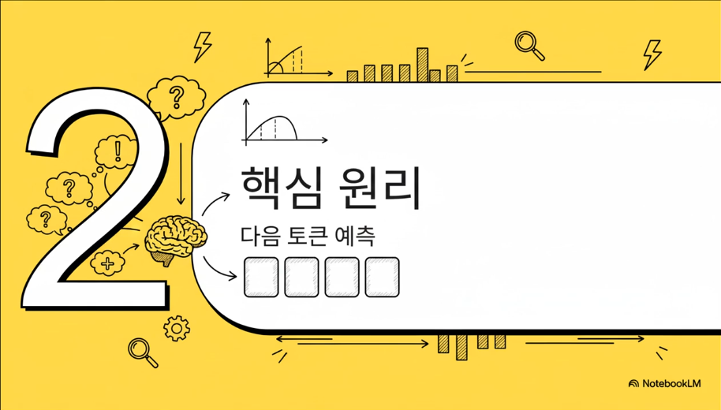
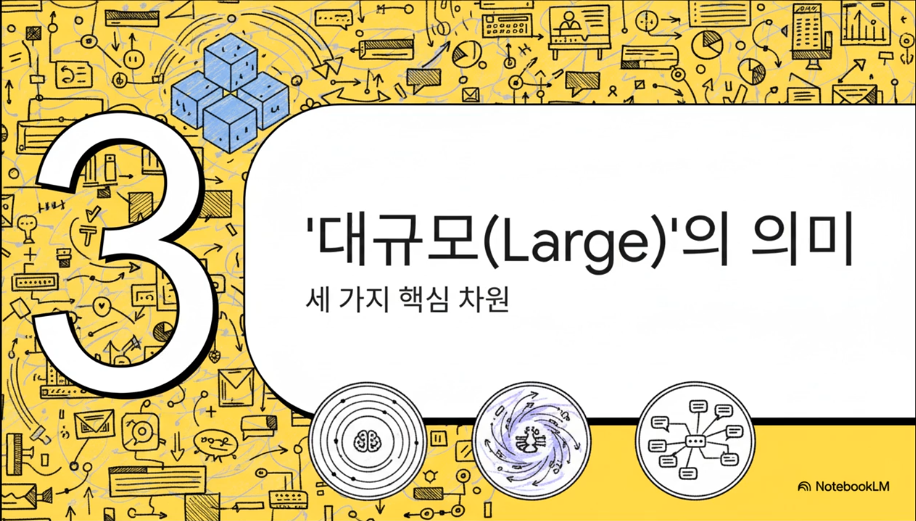

# LLM은 무엇인가?

안녕하세요. LLM 아,이 단어 진짜 요즘 어디를 가나 들리죠? 
근데 막상 그래서 LLM이 정확히 뭔데라고 물어보면 사실 딱 부러지게 설명하기가 좀 애매해요.
정보가 너무 많아서 그런가 봐요.

그래서 오늘은 그 본질, 그러니까 LRM의 가장 핵심적인 정의부터 딱 짚고 넘어갈 거예요. 
그리고 더 나아가서 그 정의 하나가 우리가 실제로 제품을 만들 때 어떤 의미를 갖는지 그 연결 고리를 한번 시원하게 파헤쳐 보겠습니다.

자, 그럼 가장 기본으로 돌아가서 근본적인 질문 하나 던져 볼게요.
LLM을 제대로 쓰려면 이게 우리가 알던 기존 소프트웨어랑 도대체 뭐가 다른지부터 알아야 하거든요. 
그 본질적인 차이점 과연 뭘까요?
특히 이걸로 뭔가 만들어야 하는 분들, 뭐 개발자나 기획자분들이라면이 질문이 정말 중요할 거예요. 
왜냐면 LLM은 그냥 좀 더 똑똑한 코드가 아니라 아예 새로운 패러다임이거든요.

(0:56) 근데 놀랍게도요. 그 핵심 차이는

(0:59) 생각보다 아주 명확하고 간단합니다.

(1:02) 바로 이겁니다. 이게 핵심이에요.

(1:05) 왼쪽에 있는 전통적인 소프트웨어는요.

(1:07) 정해진 규칙대로만 움직여요. A를

(1:10) 넣으면 무조건 B가 나오는 그런

(1:12) 결정론적 시스템인 거죠. 근데 오른쪽

(1:15) LLM은 완전히 다릅니다. 다음에 올

(1:18) 단어가 뭘 확률적으로 예측하고

(1:21) 만들어내는 시스템이에요. 그러니까

(1:23) 똑같은 질문을 해도 어쩔 땐 다른

(1:25) 대답이 나오는 거죠. 우리가 맨날

(1:28) 듣는 그 환각 현상이니 뭐니 하는

(1:29) 문제들이 바로이 근본적인 차이에서

(1:32) 시작되는 겁니다. 좋아요. 그럼이

(1:36) LM이 부리는 마법 같은 능력들

(1:38) 있잖아요. 그 근원으로 한번 들어가

(1:40) 보죠. 바로 다음 토큰 예측이라는

(1:43) 건데요. 이게 진짜 핵심 원리입니다.

(1:46) 사실 LM에 그 복잡해 보이는 모든게

(1:49) 따지고 보면이 단순한 원리 하나에서

(1:51) 나오는 거거든요. 만약에 오늘 내용

(1:54) 중에서 딱 하나만 기억해야 한다면

(1:56) 바로 이겁니다. 다음 토큰 예측.

(1:59) 자, 예를 들어 하늘은 파랗코라는

(2:02) 말을 LLM한테 주면요. 얘는 다음에

(2:05) 올 단어가 구름은일 확률, 태양은일

(2:08) 확률, 아름답다일 확률 이런 걸 전부

(2:10) 계산해요. 그리고 그중에서 아름답다가

(2:13) 가장 확률이 높네 하면서 그 단어를

(2:15) 딱 뱉어내는 거죠. 우리가 쓰는

(2:18) 번역, 요약, 심지어 코드 짜는

(2:20) 것까지이 모든 기능의 심장에는 바로이

(2:23) 확률 계산 엔진이

(2:25) 돌아가고 있는 겁니다.이 과정이 진짜

(2:27) 재밌는데요. 마치 혼자서 말을

(2:29) 이어가는 것 같아요. 한번 보세요.

(2:32) 먼저 지금까지 나온 대화 내용, 즉

(2:34) 문맥을 싹 읽어요. 이게 1단계.

(2:37) 그다음 다음에 무슨 말을 할까 하면서

(2:41) 가능한 모든 다음 단어의 확률을 쫙

(2:43) 계산하죠. 2단계입니다. 그리고

(2:45) 3단계에서 그 확률에 때라 아이

(2:48) 단어가 제일 좋겠다 하고 하나를 딱

(2:50) 고릅니다. 마지막으로 4단계에서 그

(2:53) 고른 단어를 문장에 추가하고 다시

(2:56) 처음으로 돌아가요.이 자기 회기

(2:58) 루프가 계속 빙글빙글 돌면서 토큰

(3:00) 하나가 단어가 되고 문장이 되고

(3:03) 결국엔 긴 글이 되는 겁니다. 근데

(3:06) 여기서 진짜 신기한 건 어떻게 이걸

(3:09) 해내냐는 거예요. 우리가 그는 감가에

(3:12) 있는 은행에 갔다라는 문장을 들으면

(3:15) 아 감가에 있으니까 돈 뽑는 은행이

(3:18) 아니구나 하고 바로 알잖아요.

(3:20) 감가라는 단어에 집중해서 은행의

(3:23) 의미를 파악하는 거죠. LM도

(3:25) 똑같아요. 문장 속에서 어떤 단어가

(3:28) 더 중요한지, 어디에 더 주의

(3:30) 어텐션을 기울여야 하는지 수학적으로

(3:33) 가중치를 계산합니다. 이게 바로 그

(3:36) 유명한 트랜스포머 아키텍처의 핵심

(3:39) 셀프 어텐션 메커니즘입니다. 자,

(3:41) 그럼 이제 LLM의 L 즉 라지의

(3:44) 의미를 한번 뜯어 볼까요? 우리가

(3:47) 흔히 모델이 크다라고 말할 때 그게

(3:49) 단순히 한 가지 뜻이 아니거든요.이

(3:52) 대규모라는 건 크게 세 가지를 봐야

(3:55) 해요. 첫째는 모델 파라미터의 수.

(3:58) 이걸 뭐 모델의 뇌세포수라고

(4:00) 생각하셔도 좋아요. 많을수록 더

(4:03) 복잡하고 미묘한 걸 학습할 수 있는데

(4:05) 당연히 몸값이 비싸지고 속도도

(4:07) 느려지겠죠. 둘째는 학습 데이터의

(4:10) 양. 얼마나 많은 책을 읽었냐

(4:12) 이거죠. 많이 읽을수록 아는게

(4:14) 많아지는 건 당연하고요. 마지막으로

(4:17) 컨텍스트 창 크기. 이건 일종의 단기

(4:19) 경력 같은 거예요.이 창이 클수록 더

(4:22) 긴 대화나 문서를 까먹지 않고 기억할

(4:24) 수 있는 거죠. 결국이 세 가지가

(4:27) 어떻게 조합되느냐에 따라 모델의

(4:29) 성능과 특성에 완전히 달라집니다.

(4:31) 자, 이제 정의는 확실히 잡았죠?

(4:34) 그럼 이제부터가 진짜입니다. 그래서

(4:36) 어쨌다고 하는 질문에 답을 해야죠.이

(4:39) 이 정의가 실제로 우리가 제품을 만들

(4:41) 때 현실에서 어떤 의미를 갖게

(4:43) 될까요? 첫 번째로 부딪히는 문제가

(4:46) 바로 LM이 확률 기계라는

(4:48) 사실이에요. 이게 무슨 말이냐면

(4:51) 똑같은 걸 물어봐도 할 때마다 대답이

(4:53) 조금씩 달라질 수 있다는 거죠. 뭐

(4:56) 실을 쓰거나 아이디어를 낼 때는 이게

(4:58) 장점일 수 있어요. 근데 만약

(5:00) 시스템에서 딱 정해진 형식 예를 들어

(5:03) JSON 같은 형태로 데이터를 받아야

(5:05) 한다면 어떨까요? 그때부턴 이게

(5:07) 엄청난 골칫거리가 되는 겁니다.

(5:10) 그래서 우리가 뭘 해야 하냐면요.이

(5:13) 제멋대로일 수 있는 확률 엔진

(5:15) 주변에다가 일종의 가드레이를 쳐 줘야

(5:17) 해요. 이걸 출력 계약이라고 부를 수

(5:20) 있겠네요. 프롬프트에 야, 너

(5:23) 무조건이 형식으로만 대답해야 해라고

(5:25) 아주 강력하게 지시하고 얘가 뱉어낸

(5:28) 결과물이 진짜 그 형식이 맞는지 한

(5:30) 번 더 확인하는 장치를다는 거죠.

(5:32) 이렇게 통제 불가능해 보이는 모델을

(5:34) 길들여서 우리가 원하는 신뢰할 수

(5:37) 있는 결과를 뽑아내는 겁니다. 자,

(5:39) 두 번째 문제. 이건 진짜 큰

(5:41) 한계인데요. LM은요. 말 부대로

(5:44) 과거에 사는 존재예요. 학습이 끝난

(5:46) 그 시점에 시간이 딱 멈춰 버린

(5:48) 거죠. 그러니까 어제 일어난 뉴스도

(5:51) 당연히 여러분 회사의 내부 데이터

(5:53) 같은 건 하나도 모릅니다.이 문제를

(5:55) 푸는 열쇠가 바로 검색 증강 생성

(5:58) R이입니다. 이거 10대 말에서

(6:00) 오픈북 테스트 같은 거예요. LM한테

(6:03) 그냥 내 머릿속에서만 대답해라고

(6:05) 하는게 아니라 질문을 던지기 전에

(6:08) 관련된 최신 정보를 인터넷이나

(6:11) 데이터베이스에서 싹 긁어 와요.

(6:13) 그리고 그걸 자 이거 보고 참고해서

(6:16) 대답해 하고 같이 던져 주는 거죠.

(6:19) 이러면 모델이 훨씬 더 정확하고 최신

(6:21) 정보를 담은 답변을 할 수 있게

(6:23) 됩니다. 그리고 세 번째 문제.

(6:26) 우리가 처음 정의해서 봤듯이 LM은

(6:28) 그냥 다음 단어를 예측하는 애예요.

(6:31) 말만 할 줄 알지 실제로 뭔가를

(6:33) 실행할 능력은 전혀 없습니다. 그래서

(6:36) 우리는이 말만하는 뇌에다가 손발을

(6:39) 달아 줘야 해요. 바로 도구

(6:41) 사용이라는 개념이죠. 예를 들어 오늘

(6:44) 서울 날씨 알려 줘라고 하면 LM이

(6:46) 날씨를 아는게 아니에요. 대신음 날씨

(6:50) API를 호출해야겠다라는 생각 즉

(6:52) 날씨 API를 호출해 줘라는 요청

(6:55) 텍스트를 만들어내는 거죠. 그럼

(6:57) 바깥에 있는 다른 시스템이 그 요청을

(6:59) 받아서 진짜로 API를 실행하고 그

(7:02) 결과를 다시 LLM한테 알려 주는

(7:04) 겁니다. 이렇게 하면 모델의 똑똑한

(7:07) 출론 능력이랑 외부 세계의 실제

(7:09) 기능이 딱 연결되는 거예요. 자,

(7:11) 이제 퍼즐 조각들이 거의 다

(7:13) 맞춰졌네요. 한 걸음 뒤로 물러나서이

(7:16) 모든 걸 조합했을 때 우리가 어떤 큰

(7:18) 그름을 볼 수 있는지 한번 정리해

(7:20) 보겠습니다.이 지점에서 흔한 5헤드를

(7:23) 바로 잡고 가야 합니다. 첫째,

(7:26) lm은 모든 걸 다 아는 지식

(7:28) 데이터베이스가 아니에요. 그냥 다음

(7:30) 토큰 확률 예측기일 뿐입니다. 둘째,

(7:34) 혼자서 알아서 움직이는 자율

(7:36) 에이전트도 아니고요. 행동하려면

(7:38) 외부의 도움이 꼭 필요한 추론 엔진에

(7:40) 가깝죠.이 차이를 정확하게 이해해야만

(7:43) LLM한테 뭘 시킬 수 있고 뭘

(7:45) 시키면 안 되는지 그리고 그 주변에

(7:47) 어떤 시스템을 만들어야 하는지

(7:49) 명확해집니다.

(7:51) 결국 가장 중요한 건 이거예요.

(7:53) 관점의 전환. lm은 그 자체로

(7:55) 완제품이 아닙니다. 훨씬 더 큰

(7:57) 소프트웨어 시스템 안에 들어가는 아주

(7:59) 강력까지만 어디까지나 하나의

(8:01) 부품이라는 거죠. 우리는 모델을 그냥

(8:03) 가져다 쓰는게 아니라 프롬프트,

(8:05) 데이터 검색, 도구, 검증 같은

(8:07) 것들을 전부 아우르는 하나의 거대한

(8:09) 시스템을 설계하고 엔지니어링 하고

(8:11) 있는 겁니다. 오늘 우리가 나는 모든

(8:14) 이야기를 딱 한 문장으로 압축하면

(8:16) 이렇습니다. LM은 다음 토큰 확률

(8:18) 예측기이며 실무에서의 성공은이

(8:21) 예측기를 데이터, 도구, 정책과

(8:23) 엮어서 신뢰 가능한 소프트웨어로

(8:25) 만드는데 달려 있다. 모델 자체가

(8:28) 아니라 그 모델을 어떻게 엮어서

(8:30) 시스템을 만드느냐의 성공이 달렸다는

(8:31) 거죠. 자, 마지막으로 여러분께 질문

(8:35) 하나를 던지면서 마무리할까 합니다.

(8:37) 이제 LRM을 맞는 뇌가 아니라

(8:40) 시스템의 한 부품으로 보게 되셨을

(8:42) 텐데요. 그렇다면 지금 만들고 계신

(8:46) 혹은 앞으로 만들 여러분의 시스템에서

(8:48) 가장 먼저 다시 생각해 보게 되는

(8:50) 부분은 어딘가요?

